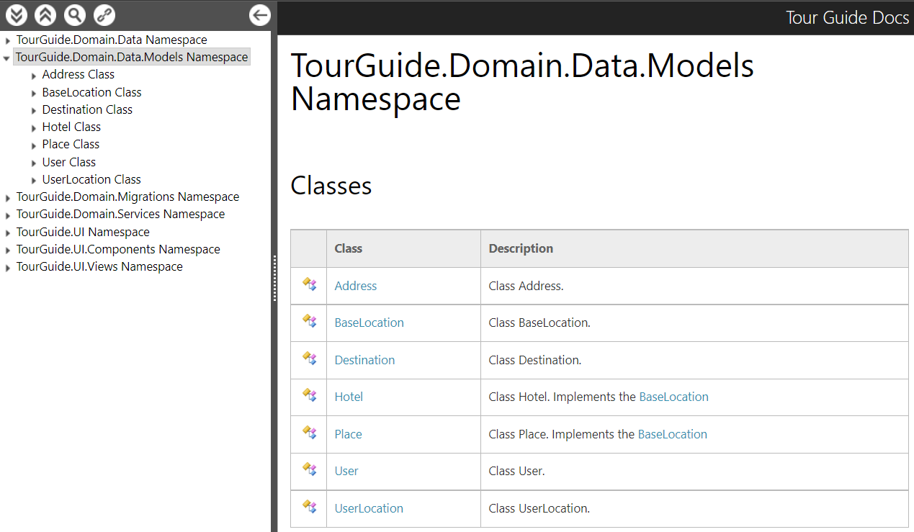
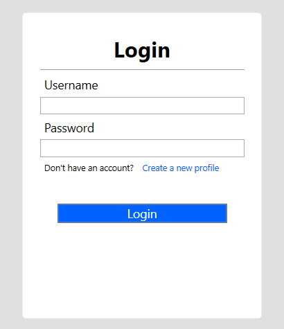
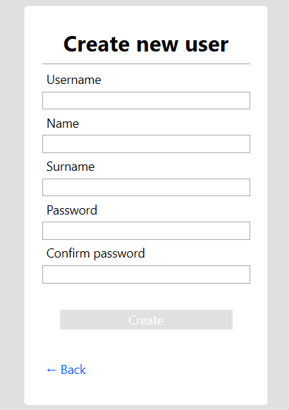

# Tour Guide Project
## Description
Mamy destynacje turystyczne np. Karaiby, Hawaje itp. Nasz tour guide pozwala przejrzeć interesujące destynacje w poszukiwaniu ciekawych miejsc. Nastepnie miejsca mogą byc dodane przez użytkownika do zakładki 'My Trips". Jednocześnie użytkownik może przejrzeć hotele znajdującec się w poblizu interesujących go miejsc. Widok hoteli znajduje się w zakładce 'Hotels'.
Zrobić tour guide, rekomendacje co można tam odwiedzić, informacje na temat hoteli, połączenia, odległości hoteli z destynacjami, polecenie najbliższych obiektów.

Aplikacja umożliwia także rejestrację i logowanie użytkownika.

## Tools

Aplikację stworzono przy pomocy:
- Frameworków:
    - Microsoft.NETCore.App (6.0.1)
    - Microsoft.WindowsDesktop.App.WPF (6.0.0)
- Pakietów:
    - Microsoft.EntityFrameworkCore (6.0.1)
    - Microsoft.EntityFrameworkCore.InMemory (6.0.1)
    - Microsoft.EntityFrameworkCore.Sqlite (6.0.1)
    - Microsoft.EntityFrameworkCore.Tools (6.0.1)
    - Microsoft.EntityFrameworkCore.Design (6.0.1)

## How To Run
- Visual Studio:
    - uruchomić solucję TourGuide.UI
- Release:
    - uruchomić plik wykonawczy `\TourGuide\TourGuide.UI\bin\Release\net6.0-windows\TourGuide.UI.exe`

## Documentation
W ramach dokumentacji opisano wszystkie używane metody oraz parametry w postaci znaczników XML w kodzie źródłowym programu.

Pełna dokumentacja dostępna jest również w formacie HTML, po lokalnym uruchomieniu pliku:
[https://github.com/szanuje/cs-project-tour-guide/blob/master/TourGuide/Help/index.html](https://github.com/szanuje/cs-project-tour-guide/blob/master/TourGuide/Help/index.html)

## Authors
- Konrad Ulman
- Paweł Jelonek
- Maksymilian Pleśniak

## Screenshots

